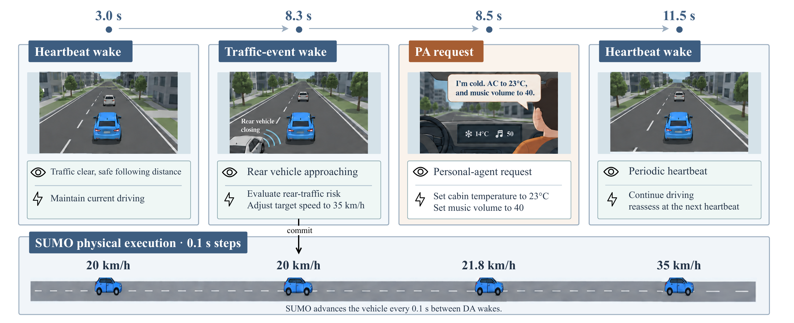
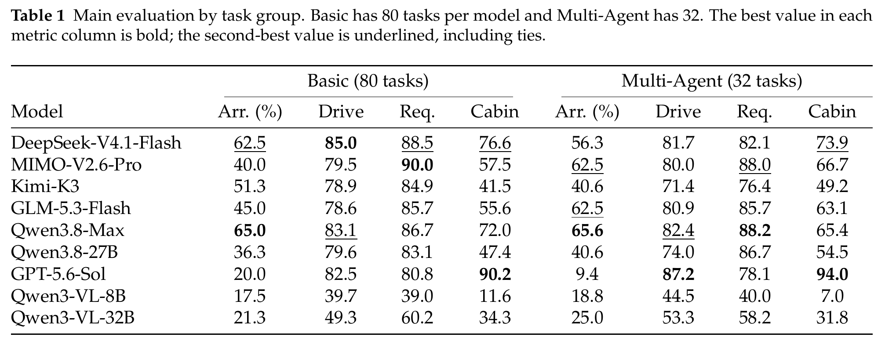

<h1 align="center">VehicleArena</h1>

<p align="center"><strong>A Realistic Urban Environment for Multi-Agent Driving</strong></p>

<div align="center">
  <a href="https://github.com/OpenMOSS/VehicleArena"></a>
  <a href="https://huggingface.co/datasets/OpenMOSS-Team/VehicleArena"></a>
  <a href="https://arxiv.org/abs/2609.35916"></a>
  <a href="https://arxiv.org/pdf/2609.35916"></a>
</div>

<p align="center"><a href="README.md">中文</a> · <a href="docs/en/README.md">English documentation</a></p>

VehicleArena is a persistent 3D urban-driving environment in which Driving Agents handle traffic and passenger requests while independently motivated agents affect one another through shared roads. Models make decisions; SUMO executes them and records the physical consequences.

**Start here:** [Quick start](#-quick-start) · [Run an LLM scene](#run-an-llm-scene) · [Evaluation and results](#-evaluation-and-results) · [Documentation](docs/en/README.md)

## 🌟 Highlights

- **Shared physical world:** SUMO advances vehicles and pedestrians at fixed 0.1-second steps, with synchronized Web3D observations of what actually happened.
- **Driving meets passenger service:** A Personal Agent issues immediate or deferred requests; the Driving Agent chooses when to wake and how to respond; a separate Judge checks outcomes against world state.
- **Decisions are not outcomes:** An LLM can request speed, braking, lane changes, junction maneuvers, and cabin operations, but cannot set its position or claim a task complete by saying so.
- **Independent agents coexist:** Several Driving Agents can operate in one scene, while remaining vehicles and pedestrians stay SUMO-native. Vehicle chassis and sensor equipment are configurable.
- **Separate evaluation axes:** 100 training/development tasks and 112 held-out tests report arrival, driving, passenger requests, cabin correctness, and traffic impact without collapsing them into one score.

## 🎬 System at a glance


Figure 1: The shared 3D world, Driving Agent, Personal Agent, and Judge. The lower timeline illustrates a deferred passenger request, driver-scheduled wake, and independent verification; it is not to scale.



Figure 2: An illustrative driving-and-service episode. The driver wakes on heartbeats or traffic events while SUMO continues to advance at 0.1-second steps. Time gaps are compressed and some intervening wakes are omitted.

## 🚀 Quick start

### Environment setup

Use Python 3.10+ and SUMO 1.25.0 for the frozen benchmark.

```bash
git clone git@github.com:OpenMOSS/VehicleArena.git
cd VehicleArena
python3 -m venv .venv
source .venv/bin/activate
python -m pip install --upgrade pip
python -m pip install -r requirements.txt
python -m pip install eclipse-sumo==1.25.0
python -m playwright install chromium
cd web3d && npm ci && cd ..
```

If the SUMO wheel is unavailable on your platform, install the same SUMO version separately and ensure `sumo`, `netconvert`, `libsumo`, `traci`, and `sumolib` are visible in the active environment.

### Install maps

The road-network bundle is distributed separately from Git. Download `vehiclearena-road-networks-2026.09.22.0.tar.gz` from the [VehicleArena dataset on Hugging Face](https://huggingface.co/datasets/OpenMOSS-Team/VehicleArena), then install it:

```bash
MAP_BUNDLE=/absolute/path/to/vehiclearena-road-networks-2026.09.22.0.tar.gz
python scripts/manage_map_bundle.py install --source "$MAP_BUNDLE"
python scripts/check_environment.py
```

Proceed when the check reports `"ready": true`. The current bundle contains 116 lane-level maps and 232 map files; the installer verifies archive and file hashes.

### SUMO smoke test

```bash
python scripts/run_experiments.py prepare-scene-manifests \
  --catalog vehiclearena/evaluation/experiments/scenarios \
  --output vehiclearena/evaluation/experiment_manifests/catalog

python scripts/run_experiments.py run \
  --manifest vehiclearena/evaluation/experiment_manifests/catalog/Basic.manifest.json \
  --output outputs/sumo-smoke \
  --variant basic_017_unsignalized_intersection \
  --sumo-reference
```

### Run an LLM scene

The API must support OpenAI-compatible Chat Completions, tool calls, and image input. Keep credentials in environment variables, not scenario files or Git.

```bash
export OPENAI_API_KEY="your-api-key"
export OPENAI_API_BASE="https://your-endpoint.example.com/v1"
export OPENAI_MODEL="your-vision-tool-model"

python scripts/run_experiments.py run \
  --manifest vehiclearena/evaluation/experiment_manifests/catalog/Basic.manifest.json \
  --output outputs/model-smoke \
  --variant basic_017_unsignalized_intersection \
  --allow-llm \
  --llm-base-url "$OPENAI_API_BASE" \
  --llm-model "$OPENAI_MODEL" \
  --llm-context-window-tokens 32768 \
  --with-personal-agent \
  --personal-agent-model "$OPENAI_MODEL" \
  --passenger-judge-model "$OPENAI_MODEL"
```

For batch runs, role-specific settings, and matched references, see the [English LLM-suite guide](docs/en/llm-suite.md).

## 📊 Evaluation and results

### Task split and time budget

The benchmark has **100 training/development tasks** and **112 held-out evaluation tasks**: 80 Basic and 32 MultiLLM. The splits do not overlap. Use `scripts/run_test_suite.py` for the fixed evaluation split; the generic runner traverses the whole scene directory unless a selection is specified.

When preparing a task release, VehicleArena calibrates each scene once with SUMO driving the evaluated vehicle as an oracle. Basic keeps all other traffic SUMO-native. MultiLLM keeps peer agents on the same models, personality prompts, and PA/Judge settings as in evaluation. Calibration waits for required SUMO-controlled trip vehicles, not LLM peers, and excludes declared persistent obstacles.

For the published 112-task split, the frozen `total_time_s` values in [`time_window_calibration.json`](vehiclearena/evaluation/experiments/time_window_calibration.json) equal the last required SUMO vehicle terminal time plus **10 simulation seconds**. A terminal event is arrival or collision; none of the selected calibration runs records a collision. Repeated runs and changes to the evaluated Driving Agent model use the same frozen deadline; calibration is not rerun for each model.

Recalibrate affected scenes only when calibration inputs change: road data in the map bundle; new or modified `scenario.json` files; or the SUMO version, simulation/calibration code, or fixed MultiLLM peer model and PA/Judge configuration. Changing only the evaluated model, documentation, or visualization does not require recalibration. The implementation is in [`time_window_calibration.py`](vehiclearena/evaluation/experiments/time_window_calibration.py); reproduce published results with the frozen registry.

### Main experimental results

The image is a direct crop of the paper's main ego-vehicle table. Each model was evaluated three times per task on 80 Basic and 32 Multi-Agent test tasks. Arr. is on-time arrival without collision or route failure (%); Drive, Req. (PA/Judge request satisfaction), and Cabin (device-rule correctness) are 0–100 scores. Higher is better in every column. These metrics are reported separately, not combined into one score.



Qwen3.8-Max has the highest arrival in both groups, while different models lead on driving, passenger requests, and cabin correctness. No single metric captures their overall behavior.

Basic contains one evaluated LLM vehicle; all other road users use SUMO. MultiLLM keeps other Driving Agents on fixed model and personality configurations and varies only the evaluated vehicle. For a matched reference, SUMO replaces all LLM vehicles in Basic, but only the evaluated vehicle in MultiLLM. The latter keeps fixed peers and their passenger-agent configurations. This isolates the evaluated vehicle's contribution to traffic outcomes.

See [evaluation protocol](docs/en/evaluation.md), [architecture](docs/en/architecture.md), and the [full English documentation index](docs/en/README.md).

## 🛠 Development

```bash
python -m pytest -q
python scripts/validate_extension.py \
  --extension docs.examples.fleet_extension \
  --scenario docs/examples/extended_scenario.json \
  --rules docs/examples/rules
```

`vehiclearena/` contains simulation, vehicle modules, and evaluation code; `scripts/` contains command-line tools; `web3d/` contains the 3D viewer; `docs/` contains usage, evaluation, and extension guides.

## 📎 Citation

If VehicleArena helps your research, please cite the [paper](https://arxiv.org/abs/2609.35916):

```bibtex
@article{yang2026vehiclearena,
  title={VehicleArena: A Realistic Urban Environment for Multi-Agent Driving},
  author={Yang, Jie and Chen, Jiajun and Zhou, Jiazheng and Huang, Mianqiu and Zheng, Yining and Wang, Yuxin and Qiu, Xipeng},
  journal={arXiv preprint arXiv:2609.35916},
  year={2026}
}
```
