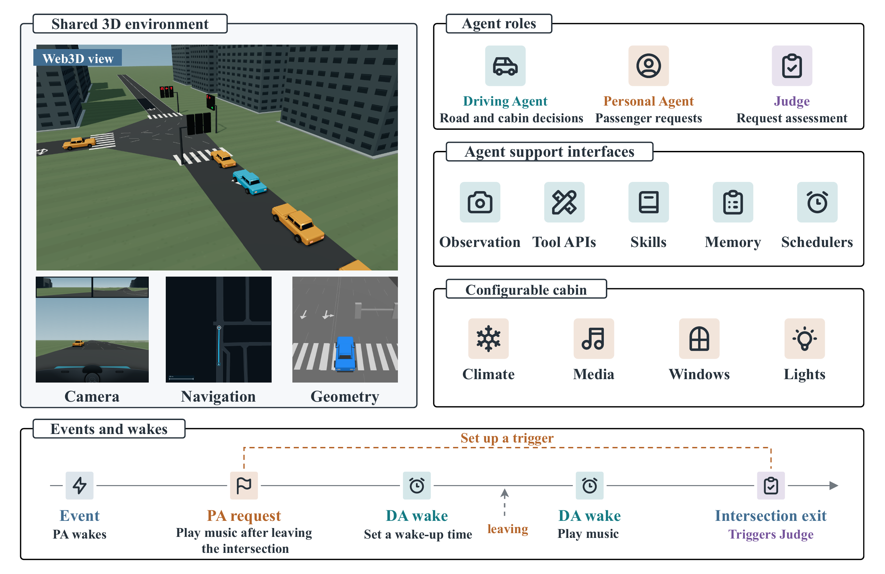
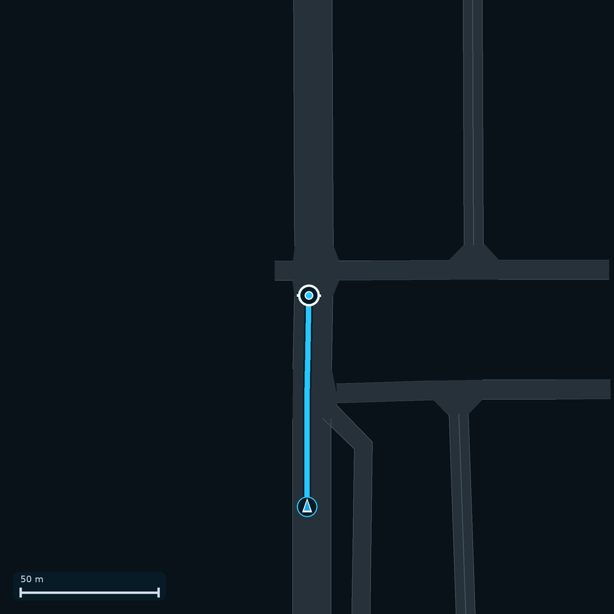
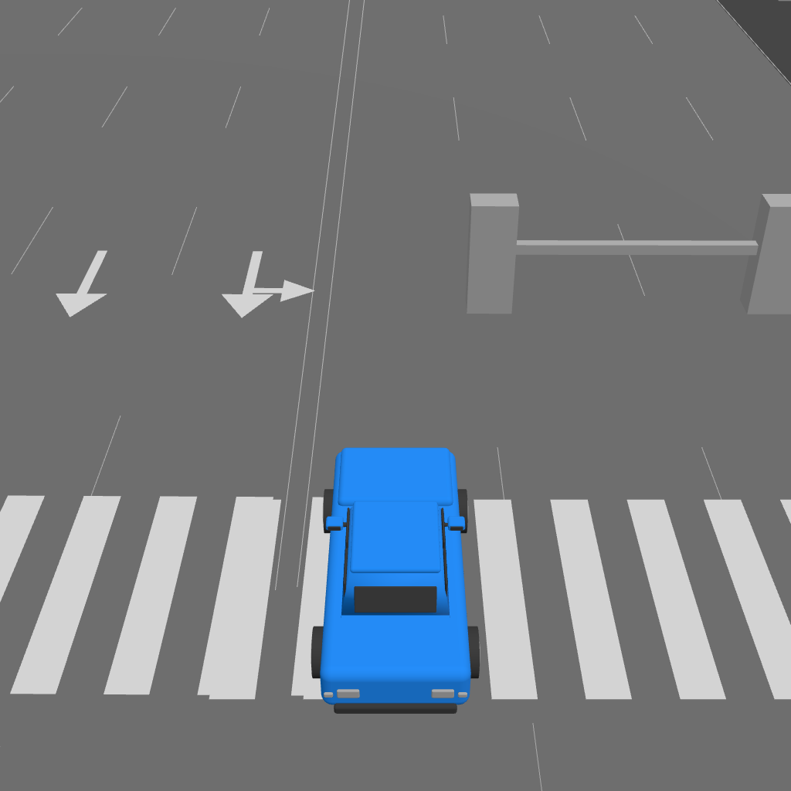

# Architecture and execution boundary

[中文](../02-architecture.md) · [English index](README.md)

VehicleArena gives multiple agents decisions in one persistent traffic world. SUMO executes road motion and collisions; `VehicleWorld` executes cabin-device operations. A model may request an action, but it cannot rewrite the vehicle's position, erase a collision, or declare its own task complete.

The figure shows the shared world, the three agent roles, and how passenger requests, driver wakes, and verification occur on one simulation timeline. The observation images illustrate available views; installed equipment determines which optional sensors a vehicle can use.

The Driving Agent chooses speed, braking, lane and junction actions, and cabin operations from its local observations. The Personal Agent represents the passenger and submits immediate or deferred requests that are delivered to the driver. The Passenger Judge checks the resulting trajectory independently; a Judge check is not an extra driving-control opportunity.

`MultiSimEngine` maintains one SUMO world. At each 0.1-second physics step, SUMO advances vehicles and pedestrians and resolves road interactions and collisions. Background traffic remains SUMO-native; selected vehicles in MultiLLM scenes have independent LLM drivers. Each vehicle's `VehicleWorld` keeps its own equipment and cabin state. Scenario JSON fixes the map, initial conditions, participants, and scheduled events.

Tool requests pass capability and argument checks. Driving controls then go to SUMO, while cabin commands go to the installed module. Later observations and scores reflect what actually happened, not what the model intended or claimed. The Web3D cockpit and optional local geometry view render from the same synchronized state. A navigation minimap advises on a route but never steers the car. Global diagnostic images and `sumo-gui` screenshots are for debugging, not agent input, because they can reveal information outside the driver's local view.

| Advisory route display | Optional local 3D geometry |
|:---:|:---:|
|  |  |

The route highlight is not an executed maneuver. The geometry image is a processed 3D view rather than raw LiDAR points, and is available only to vehicles equipped with the sensor.

For extension interfaces, see the [reference overview](reference.md).
